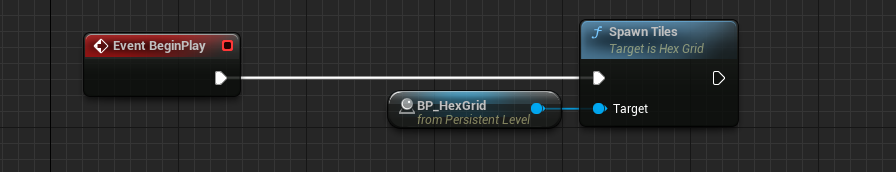
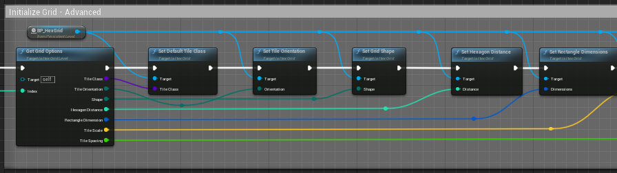
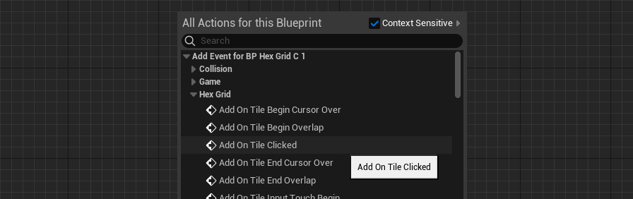
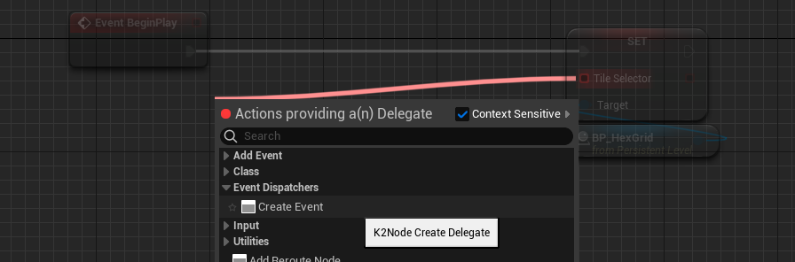
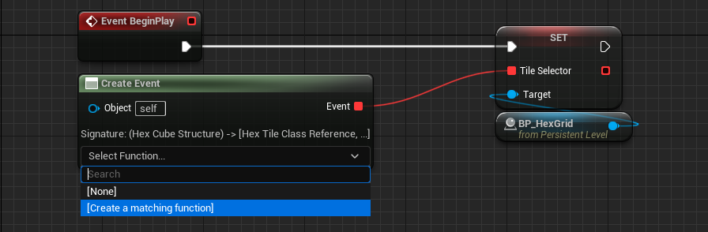
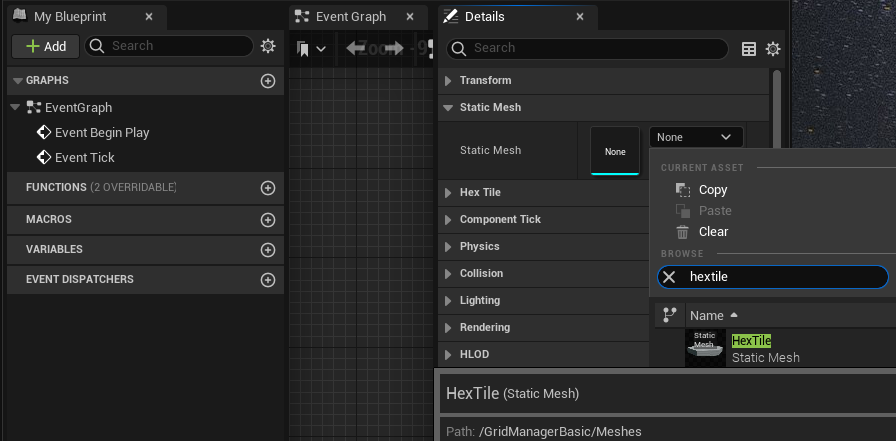
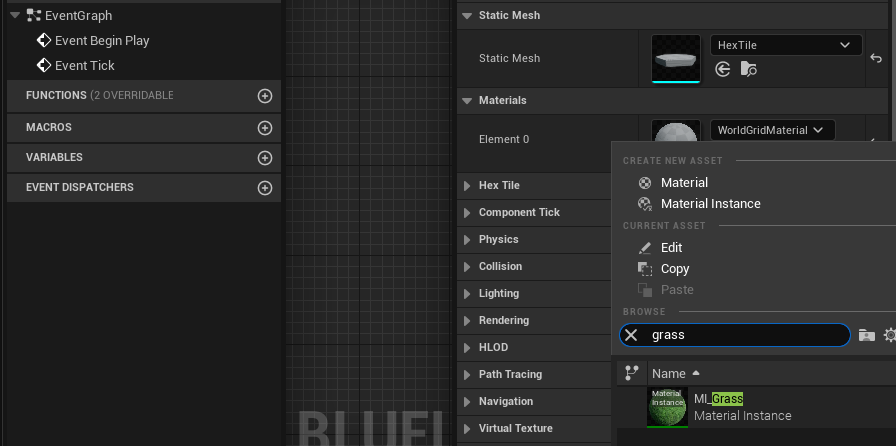
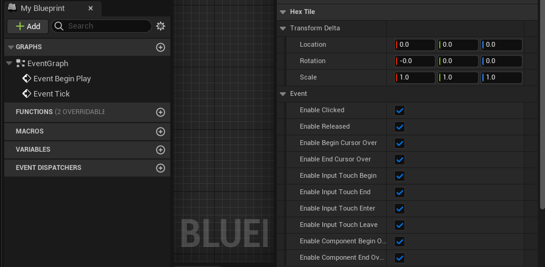
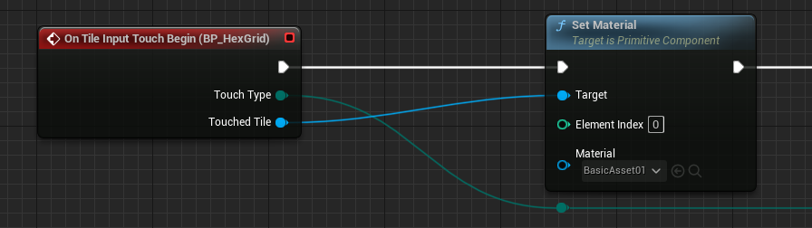
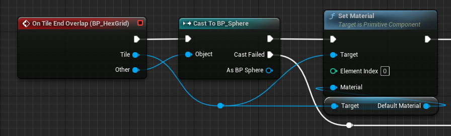

# Hex>Grid Manager #

[Hex>Grid Manager](../../README.md) is an Unreal Engine Plugin that allows developers to quickly create interactive, customizable, hexagon tile grids for their games. If you would like a step-by-step explanation of setup and some example implementations, you should check out the [tutorial](../tutorials/hexgridmanager_basic/hexgridmanager_basic.md).

&nbsp;

## Table of Contents ##

[Hex>Grid Manager](#hexgrid-manager)

* Basic [Setup](#setup) is quick and easy.
* [Advanced Setup](#advanced-setup).
  * [Subscribing to Events](#subscribing-to-events)
  * [Select Which Tile to Spawn](#select-which-tile-to-spawn)
  * [Create Custom HexTile Classes](#create-custom-hextile-classes)
  * [HexTile Properties](#hextile-properties)
* [Advanced Usage](#advanced-usage)
* [Structures](#structures)
* [Functions](#functions)
* [Delegates](#delegates)
* [Events](#events)
* [DataTypes](#datatypes)
* [Support](#support)

&nbsp;

## Setup ##

* Place the **BP_HexGridManager** Actor into your scene/level from the Content Drawer,
  just like any other asset.

* Select the HexGridManager Actor and find the **Hex Tile** & **Hex Grid** sections in the **Details** sidebar.
  Set Grid and Tile Options. Optionally, click the **Spawn Tiles** button to spawn
  the grid in the editor.

* Open the Level Blueprint (with the HexGridManager selected) and place the **Spawn Tiles**
  Blueprint function node. ("Call Function on *BP Hex Grid Manager > Hex Grid > Spawn Tiles*")
  and connect it to the Event BeginPlay node.

&nbsp;

## Advanced Setup ##

* Grid and Tile configuration can also be set from the Level Blueprint with the SetDefaultTileClass, SetTileOrientation, SetGridShape, SetRectangleDimensions, SetHexagonDistance, SetTileSpacing, & SetTileScale nodes.

&nbsp;

### Subscribing to Events ###

* From the Level Blueprint (when the HexGridManager is selected on the level editor), Right-click and then select
  "Add Event for BP Hex Grid Manager > Hex Grid > Add On Tile Clicked"

* Place Blueprint nodes normally.

&nbsp;

### Select Which Tile To Spawn ###

* On the Level Blueprint, create a reference to the HexGridManager (with the HexGridManager selected on the level editor, right-click the graph and select "*Create a Reference to BP_HexGridManager*").
* Drag the pin from HexGridManager and create node, "*Variables > HexTile > Set Tile Selector*":

* From the new, *Set* node, drag the *Tile Selector* pin and select "*Event Dispatchers > Create Event*":

* From the new, *Create Event* node, open the *Select Function...* drop-down menu and select "*\[Create a matching function\]*":

* A new function will be created on the Blueprint with the suffix *_AutoGenFunc*. Rename this function to "Select Tile Class".
* Open the function in the editor and set the return value to a HexTile Class reference:

In the above example, we're setting the Tile Class arbitrarily, based on the HexOffset Y-value. This function is where you can specify your tile placement logic.

&nbsp;

### Create Custom HexTile Classes ###

Unless you plan on populating your game with pink tiles, you're going to have to create your own, custom, HexTile class(es). This is easy to do, and can be a useful part of your game logic, if you choose.

* Navigate to *All> Plugins> GridManagerBasic C++ Classes> GridManager> Public*, right-click on the HexTile C++ class, and select "Create Blueprint class based on HexTile".

* Name the Blueprint and save it to *All> Content> Blueprints*. Open/Edit the new Blueprint, select *Tile Mesh* in the Components toolbar, then find "*Details> Static Mesh> Static Mesh*", and select your mesh.

* Assign a Material and Compile/Save the Blueprint.

&nbsp;

### HexTile Properties ###

Two sets of properties can be found in "*Details> Hex Tile*", *Transform Delta*, and *Event*. The *Enable* toggles in **Event** tell HexGridManager whether to bind events to these tiles (which happens during the call to *PlaceTile*).

**Transform Delta** provides class-specific adjustments to tile placement that can be helpful in the case of mixing tile classes. For example, since TileMesh "depth" (Y) drives calculations on placement, these differently sized tiles have wildly incongruent placements:

By adjusting the *Transform Delta* to compensate for the differences,

we can make adjustments to the tile:

&nbsp;

## Advanced Usage ##

The [tutorial](../tutorials/hexgridmanager_basic/hexgridmanager_basic.md) is a good place to learn some basic HexGridManager usage. This section is designed to show both how versatile this plugin is and how it works under the covers.

### Spawn Rectangle ###

This Blueprint shows basically what the *SpawnTiles* C++ function does behind-the-scenes when *GridShape* is set to Rectangle. One thing missing: the fallback to the default tile class.

### Spawn Hexagon ###

This Blueprint shows what *SpawnTiles* C++ function does behind-the-scenes when *GridShape* is set to Hexagon. Missing here: the center tile still needs to be spawned.

### Calculate Tile Location ###

This Blueprint shows how our C++ classes prepare to call *Calculate Tile Location*. Each tile class can have different dimensions, and that affects the outcome of calculations. Here is a simplification of what happens before a tile's location is calculated.

### Get Neighbors ###

This Blueprint shows how *GetNeighbors* C++ function works behind-the-scenes: it calls *GetNeighborsAtDistance* recursively for each distance.

&nbsp;

## Structures ##

### Coordinates (HexCube) ###

The [HexCube](#hexcube) structure is used to communicate and store hexagon tile coordinates with 3 integers: Q, R, & S. The sum of these values must be zero. TileOrientation is also stored, as it is required for conversions and calculations. HexGridManager uses these coordinates as identifiers, and are required parameters in functions such as [SpawnTile](#spawntile), [GetTile](#gettile), & [DestroyTile](#destroytile).

### HexOffset Coordinates ###

The [HexOffset](#hexoffset) structure is used to communicate tile coordinates with 2 integers: X & Y. These correlate roughly with rows and columns and are easier to understand than HexCube coordinates. TileOrientation is also stored, as it is required for conversions and calculations. HexGridManager can convert offset coordinates to cube coordinates and vice versa.

### HexagonDimensions ###

The [HexagonDimensions](#hexagondimensions) structure carries information about the properties of the tile mesh and grid settings. HexGridManager needs these values along with some hidden, calculated values to perform integral operations.

### HexTile Blueprint Function Library ###

Included with the HexTile C++ library is a Blueprint Function Library containing 2 conversion functions that will be available on any Blueprint.

HexTile also has a convenience function, *GetOffset* that is available from HexTile nodes.

&nbsp;

## Functions ##

All functions are available on Blueprints from a BP_HexGridManager instance reference.

[CalculateTileLocation](#calculatetilelocation), [CalculateLocalTileLocation](#calculatelocaltilelocation), [DestroyTile](#destroytile), [DestroyTiles](#destroytiles), [GetNeighbors](#getneighbors), [GetNeighborsAtDistance](#getneighborsatdistance), [GetNeighborTiles](#getneighbortiles), [GetNeighborTilesAtDistance](#getneighbortilesatdistance), [GetTile](#gettile), [GetTiles](#gettiles), [GetTileMeshDimensions](#gettilemeshdimensions), [PlaceTile](#placetile), [SetDefaultTileClass](#setdefaulttileclass), [SetGridShape](#setgridshape), [SetHexagonDistance](#sethexagondistance), [SetRectangleDimensions](#setrectangledimensions), [SetTileOrientation](#settileorientation), [SetTileSpacing](#settilespacing), [SetTileScale](#settilescale), [SpawnTile](#spawntile), [SpawnTiles](#spawntiles), & [TileExists](#tileexists)

&nbsp;

### CalculateTileLocation ###

---

Get the calculated world location of a specific tile. This function is used to determine the placement of hexagon tiles while spawning a grid of tiles.

>[*Vector*](#vector) &nbsp; **CalculateTileLocation** &nbsp; ([HexCube](#hexcube) `Coordinates`, [HexagonDimensions](#hexagondimensions) `Dimensions`);

**Parameters**\
 &nbsp; &nbsp; `Coordinates` &nbsp; [HexCube](#hexcube "HexCube Coordinates") &nbsp; - &nbsp; Hexagon coordinates of tile to get world position of.\
 &nbsp; &nbsp; `Dimensions` &nbsp; [HexagonDimensions](#hexagondimensions "Hexagon Dimensions") &nbsp; - &nbsp; HexTile properties required to calculate location.

**Returns**\
 &nbsp; &nbsp; [*Vector*](#vector) - World position vector (x,y,z).\
&nbsp;\
Location is calculated on the assumption that the grid manager rotation is (0, 0, 0). Z is taken from grid manager. If you need a tile position from a rotated grid, it is better to get the tile (GetTile) and get then the position through the usual Blueprint means. We will update this function in a future release to handle grid rotation.

&nbsp;

### CalculateLocalTileLocation ###

---

Get the location of a specific tile relative to the Grid Manager.

>[*Vector*](#vector) &nbsp; **CalculateLocalTileLocation** &nbsp; ([HexCube](#hexcube) `Coordinates`, [HexagonDimensions](#hexagondimensions) `Dimensions`);

**Parameters**\
 &nbsp; &nbsp; `Coordinates` &nbsp; [HexCube](#hexcube "HexCube Coordinates") &nbsp; - &nbsp; Hexagon coordinates of tile to get local position of.\
 &nbsp; &nbsp; `Dimensions` &nbsp; [HexagonDimensions](#hexagondimensions "Hexagon Dimensions") &nbsp; - &nbsp; HexTile properties required to calculate location.

**Returns**\
 &nbsp; &nbsp; [*Vector*](#vector) - Local position vector (x,y,z).

&nbsp;

### DestroyTile ###

---

Remove a specific, spawned tile from the grid. If the tile does not exist, function returns quietly.

>[*void*](#void) &nbsp; **DestroyTile** &nbsp; ([HexCube](#hexcube) `Coordinates`);

**Parameters**\
 &nbsp; &nbsp; `Coordinates` &nbsp; [HexCube](#hexcube "HexCube Coordinates") &nbsp; - &nbsp; Hexagon coordinates of tile to get rid of.

&nbsp;

### DestroyTiles ###

---

Remove all spawned tiles, if any, from the grid.

>[*void*](#void) &nbsp; **DestroyTiles** &nbsp; ();

&nbsp;

### GetNeighbors ###

---

Get List of all neighboring tile coordinates out to a specified distance.

>Array\<[HexCube](#hexcube)\> &nbsp; **GetNeighbors** &nbsp; ([HexCube](#hexcube) `Center`, [Int](#int) `MaxDistance`);

**Parameters**\
 &nbsp; &nbsp; `Center` &nbsp; [HexCube](#hexcube "HexCube Coordinates") &nbsp; - &nbsp; Hexagon coordinates of tile to get neighbor coordinates of.\
 &nbsp; &nbsp; `MaxDistance` &nbsp; [Int](#int "How many tiles away from Tile to include in List") &nbsp; - &nbsp; How many tiles away from Center tile to include in List.

**Returns**\
 &nbsp; &nbsp; *Array\<[HexCube](#hexcube)\>* &nbsp; - &nbsp; List of neighboring tile coordinates.

&nbsp;

### GetNeighborsAtDistance ###

---

Get List of neighboring tile coordinates at a specific distance.

>Array\<[HexCube](#hexcube)\> &nbsp; **GetNeighborsAtDistance** &nbsp; ([HexCube](#hexcube) `Center`, [Int](#int) `Distance`);

**Parameters**\
 &nbsp; &nbsp; `Center` &nbsp; [HexCube](#hexcube "HexCube Coordinates") &nbsp; - &nbsp; Hexagon coordinates of tile to get neighbors of.\
 &nbsp; &nbsp; `Distance` &nbsp; [Int](#int "get tile coordinates at exactly this distance") &nbsp; - &nbsp; Get coordinates of tiles at this distance from center tile.

**Returns**\
 &nbsp; &nbsp; Array\<[HexCube](#hexcube)\> - List of neighboring tiles.

&nbsp;

### GetNeighborTiles ###

---

Get List of all neighboring tiles out to a specified distance.

>*Array\<[HexTile](#hextile)\>* &nbsp; **GetNeighborTiles** &nbsp; ([HexCube](#hexcube) `Center`, &nbsp; [Int](#int) `MaxDistance`);

**Parameters**\
 &nbsp; &nbsp; `Center` &nbsp; [HexCube](#hexcube "HexCube Coordinates") &nbsp; - &nbsp; Hexagon coordinates of the tile to list neighbors of.\
 &nbsp; &nbsp; `MaxDistance` &nbsp; [Int](#int "How many tiles away from Tile to include in List") &nbsp; - &nbsp; How far away, in tiles, from Center tile to include in List.

**Returns**\
 &nbsp; &nbsp; *Array\<[HexTile](#hextile)\>* &nbsp; - &nbsp; List of neighboring tiles.

&nbsp;

### GetNeighborTilesAtDistance ###

---

Get List of neighboring tiles at a specific distance.

>*Array\<[HexTile](#hextile)\>* &nbsp; **GetNeighborTilesAtDistance** &nbsp; ([HexCube](#hexcube) `Center`, &nbsp; [Int](#int) `Distance`);

**Parameters**\
 &nbsp; &nbsp; `Center` &nbsp; [HexCube](#hexcube "HexCube Coordinates") &nbsp; - &nbsp; Hexagon coordinates of the tile to list neighbors of.\
 &nbsp; &nbsp; `Distance` &nbsp; [Int](#int "get tiles at exactly this distance") &nbsp; - &nbsp; Get tiles at this distance from center tile.

**Returns**\
 &nbsp; &nbsp; *Array\<[HexTile](#hextile)\>* &nbsp; - &nbsp; List of neighboring tiles.

&nbsp;

### GetTile ###

---

Get reference to specific instance of a tile by hex coordinates. This call will result in an unhandled exception if the tile does not exist. It is recommended to call [TileExists](#tileexists) just prior.

>[*HexTile*](#hextile) &nbsp; **GetTile** &nbsp; ([HexCube](#hexcube) `Coordinates`);

**Parameters**\
 &nbsp; &nbsp; `Coordinates` &nbsp; [HexCube](#hexcube "HexCube Coordinates") &nbsp; - &nbsp; Hexagon coordinates of tile to get reference for.

**Returns**\
 &nbsp; &nbsp; [*HexTile*](#hextile) - Tile instance at the specified coordinates.

&nbsp;

### GetTiles ###

---

Get a list of references of all spawned tile instances.

>*Array\<[HexTile](#hextile)\>* &nbsp; **GetTiles** &nbsp; ([Int](#int) `MaxCount`);

**Parameters**\
 &nbsp; &nbsp; `MaxCount` &nbsp; [Int](#int "Maximum number of Tiles to return") &nbsp; - &nbsp; Maximum number of tiles to return. Values < 1 will return all spawned tiles.

**Returns**\
 &nbsp; &nbsp; *Array\<[HexTile](#hextile)\>* &nbsp; - &nbsp; List of tiles.

&nbsp;

### GetTileMeshDimensions ###

---

Get size dimensions of TileMesh associated with a HexTile derivative class.

>*[Vector](#vector)* &nbsp; **GetTileMeshDimensions** &nbsp; ([HexTileClassReference](#hextileclassreference) `TileClass`);

**Parameters**\
 &nbsp; &nbsp; `TileClass` &nbsp; [HexTileClassReference](#hextileclassreference "HexTile class reference") &nbsp; - &nbsp; HexTile class reference to get mesh dimensions for.

**Returns**\
 &nbsp; &nbsp; *[Vector](#vector)* &nbsp; - &nbsp; Mesh size dimensions (x, y, z).

&nbsp;

### PlaceTile ###

---

Place a single tile into the HexGridManager grid. Utilizing the grid configuration, this function analyzes the properties of the tile instance, sets its' scale, rotation, & translation, binds the tile to the HexGridManager's event handlers, attaches the tile to the HexGridManager's Actor, and stores the tile in HexGridManager's internal matrix.

>[*void*](#void) &nbsp; **PlaceTile** &nbsp; ([*HexTile*](#hextile) `Tile`);

**Parameters**\
 &nbsp; &nbsp; `Tile` &nbsp; [*HexTile*](#hextile "HexTile class reference") &nbsp; - &nbsp; HexTile instance to place in the HexGridManager grid.

&nbsp;

### SetDefaultTileClass ###

---

Set the default HexTile Class that HexGridManager will use to spawn tile instances from.\
It should be a Blueprint inheriting from HexTile (BP_HexTile is an example and it is included with the plugin).

>[*void*](#void) &nbsp; **SetDefaultTileClass** &nbsp; ([HexTileClassReference](#hextileclassreference) `Tile Class`);

**Parameters**\
 &nbsp; &nbsp; `Tile Class` &nbsp; [HexTileClassReference](#hextileclassreference "A HexTile-derived class that HexGridManager will spawn tile from") &nbsp; - &nbsp; A HexTile-derived class that HexGridManager will spawn tile from.

&nbsp;

### SetGridShape ###

---

Set the shape of the tile grid. Rectangle or Hexagon.

>[*void*](#void) &nbsp; **SetGridShape** &nbsp; ([GridShapeEnum](#gridshapeenum) `Shape`);

**Parameters**\
 &nbsp; &nbsp; `Shape` &nbsp; [GridShapeEnum](#gridshapeenum "Possible shapes for the tile grid") &nbsp; - &nbsp; The shape of the tile grid.

&nbsp;

### SetHexagonDistance ###

---

Set the size of the hexagon grid by tiles from center. HexGridManager will use this value when spawning tiles if **GridShape** is set to *Hexagon*.

>[*void*](#void) &nbsp; **SetHexagonDistance** &nbsp; ([Int](#int) `Distance`);

**Parameters**\
 &nbsp; &nbsp; `Distance` &nbsp; [Int](#int "Size of grid in number of tiles distant from center tile") &nbsp; - &nbsp; Size of grid in number of tiles distant from center tile.

&nbsp;

### SetRectangleDimensions ###

---

Set the size of the grid in tiles by columns and rows. HexGridManager will use these values when spawning tiles if **GridShape** is set to *Rectangle*.

>[*void*](#void) &nbsp; **SetRectangleDimensions** &nbsp; ([IntPoint](#intpoint) `Dimensions`);

**Parameters**\
 &nbsp; &nbsp; `Dimensions` &nbsp; [IntPoint](#intpoint "Size of grid in number of tiles wide (x) by tiles deep (y)") &nbsp; - &nbsp; Size of grid in number of tiles wide (x) by tiles deep (y).

&nbsp;

### SetTileOrientation ###

---

Set the grid-tile orientation scheme; Pointy-Top-Odds-Right, Pointy-Top-Odds-Left, Flat-Top-Odds-Down, & Flat-Top-Odds-Up.

>[*void*](#void) &nbsp; **SetTileOrientation** &nbsp; ([TileOrientationEnum](#tileorientationenum) `Orientation`);

**Parameters**\
 &nbsp; &nbsp; `Orientation` &nbsp; [TileOrientationEnum](#tileorientationenum "One of four possible tile orientations for the grid to spawn") &nbsp; - &nbsp; One of four possible tile orientations for the grid to spawn.

&nbsp;

### SetTileScale ###

---

Set the scale for all tiles. - If you need to scale some tile classes differently, you can [set a delta transform](#hextile-properties) on each HexTile Blueprint.

>[*void*](#void) &nbsp; **SetTileScale** &nbsp; ([Vector](#vector) `Scale`);

**Parameters**\
 &nbsp; &nbsp; `Scale` &nbsp; [Vector](#vector "Scale (x, y, z) to set on each tile") &nbsp; - &nbsp; Scale (x, y, z) to set on each tile during placement.

&nbsp;

### SetTileSpacing ###

---

Set the width of the space between the tiles.

>[*void*](#void) &nbsp; **SetTileSpacing** &nbsp; ([Float](#float) `Spacing`);

**Parameters**\
 &nbsp; &nbsp; `Spacing` &nbsp; [Float](#float "Amount of space to keep between tiles") &nbsp; - &nbsp; Amount of space to keep between tiles.

&nbsp;

### SpawnTile ###

---

Create and place a single tile in accordance with the HexGridManager configuration. If 'None' is specified for *TileClass*, then *[Select Tile Class Delegate](#select-which-tile-to-spawn)* will be used and by default, the *DefaultTileClass* is used.

>[*HexTile*](#hextile) &nbsp; **SpawnTile** &nbsp; ([HexCube](#hexcube) `Coordinates`, [HexTileClassReference](#hextileclassreference) `TileClass`);

**Parameters**\
 &nbsp; &nbsp; `Coordinates` &nbsp; [HexCube](#hexcube "HexCube Coordinates") &nbsp; - &nbsp; Hexagon coordinates indicating where to place spawned tile.\
 &nbsp; &nbsp; `TileClass` &nbsp; [HexTileClassReference](#hextileclassreference "A HexTile-derived class that HexGridManager will spawn tile from") &nbsp; - &nbsp; A HexTile-derived class that the tile will spawn from.

**Returns**\
 &nbsp; &nbsp; [*HexTile*](#hextile) - Instance reference to newly spawned tile.

&nbsp;

### SpawnTiles ###

---

Create and place tiles according to the HexGridManager configuration. This will remove all existing tiles and generate a rectangle or hexagon grid from the default tile class or the tile selection delegate.

>[*void*](#void) &nbsp; **SpawnTiles** &nbsp; ();

&nbsp;

### TileExists ###

---

Check if a tile exists at hex coordinates.

>[*bool*](#bool) &nbsp; **TileExists** &nbsp; ([HexCube](#hexcube) `Coordinates`);

**Parameters**\
 &nbsp; &nbsp; `Coordinates` &nbsp; [HexCube](#hexcube "HexCube Coordinates") &nbsp; - &nbsp; Hexagon coordinates to look for a tile at.

**Returns**\
 &nbsp; &nbsp; [*bool*](#bool) - true, if a tile is found.

&nbsp;

&nbsp;

## Delegates ##

### TileSelector ###

Set the Blueprint function that HexGridManager will use to determine which HexTile Class to spawn tiles from. This function will be called before each tile is spawned. The HexTile Class returned by the function will be used to spawn the tile.

>[HexTileClassReference](#hextileclassreference) &nbsp; **TileSelector** &nbsp; ([HexCube](#hexcube) `Coordinates`);

**Parameters**\
 &nbsp; &nbsp; `Coordinates` &nbsp; [HexCube](#hexcube "HexCube Coordinates") &nbsp; - &nbsp; Hexagon coordinates of tile that is about to be spawned.

**Returns**\
 &nbsp; &nbsp; [*HexTileClassReference*](#hextileclassreference) - Class reference to HexTile class to use to spawn tile from.

&nbsp;

&nbsp;

## Events ##

[Clicked](#clicked), [Released](#released), [BeginCursorOver](#begincursorover), [EndCursorOver](#endcursorover),
  [TouchBegin](#touchbegin), [TouchEnd](#touchend), [TouchEnter](#touchenter), [TouchLeave](#touchleave), [BeginOverlap](#beginoverlap), & [EndOverlap](#endoverlap)

&nbsp;

### Clicked ###

---

Event fires on mouse down for any tile.

**Parameters**\
 &nbsp; &nbsp; `Touched Tile` &nbsp; [HexTile](#hextile "Instance reference of clicked-on tile") &nbsp; - &nbsp; Instance reference of clicked-on tile.\
 &nbsp; &nbsp; `Button Pressed` &nbsp; [KeyStructure](#keystructure "Information about which button was pressed") &nbsp; - &nbsp; Information about which button was pressed. Mouse only.

&nbsp;

### Released ###

---

Event fires on mouse up for any tile.

**Parameters**\
 &nbsp; &nbsp; `Touched Tile` &nbsp; [HexTile](#hextile "Instance reference of clicked-on tile") &nbsp; - &nbsp; Instance reference of clicked-on tile.\
 &nbsp; &nbsp; `Button Pressed` &nbsp; [KeyStructure](#keystructure "Information about which button was pressed") &nbsp; - &nbsp; Information about which button was pressed. Mouse only.

&nbsp;

### BeginCursorOver ###

---

Event fires when mouse cursor starts pointing to a tile.

**Parameters**\
 &nbsp; &nbsp; `Touched Tile` &nbsp; [HexTile](#hextile "Instance reference of hovered-over tile") &nbsp; - &nbsp; Instance reference of hovered-over tile.

&nbsp;

### EndCursorOver ###

---

Event fires when mouse cursor stops pointing to a tile.

**Parameters**\
 &nbsp; &nbsp; `Touched Tile` &nbsp; [HexTile](#hextile "Instance reference of hovered-over tile") &nbsp; - &nbsp; Instance reference of hovered-over tile.

&nbsp;

### TouchBegin ###

---

Event fires when the player begins touching the viewport on a tile.

**Parameters**\
 &nbsp; &nbsp; `Touch Type` &nbsp; [TouchIndex](#touchindex "ETouchIndex") &nbsp; - &nbsp; ETouchIndex/?.\
 &nbsp; &nbsp; `Touched Tile` &nbsp; [HexTile](#hextile "Instance reference of touched tile") &nbsp; - &nbsp; Instance reference of touched tile.

&nbsp;

### TouchEnd ###

---

Event fires when the player ends touching the viewport while on a tile.

**Parameters**\
 &nbsp; &nbsp; `Touch Type` &nbsp; [TouchIndex](#touchindex "ETouchIndex") &nbsp; - &nbsp; ETouchIndex/?.\
 &nbsp; &nbsp; `Touched Tile` &nbsp; [HexTile](#hextile "Instance reference of touched tile") &nbsp; - &nbsp; Instance reference of touched tile.

&nbsp;

### TouchEnter ###

---

Event fires when the player begins touching any tile (also fires immediately after TouchBegin).

**Parameters**\
 &nbsp; &nbsp; `Touch Type` &nbsp; [TouchIndex](#touchindex "ETouchIndex") &nbsp; - &nbsp; ETouchIndex/?.\
 &nbsp; &nbsp; `Touched Tile` &nbsp; [HexTile](#hextile "Instance reference of touched tile") &nbsp; - &nbsp; Instance reference of touched tile.

&nbsp;

### TouchLeave ###

---

Event fires when the player stops touching any tile (also fires immediately after TouchEnd).

**Parameters**\
 &nbsp; &nbsp; `Touch Type` &nbsp; [TouchIndex](#touchindex "ETouchIndex") &nbsp; - &nbsp; ETouchIndex/?.\
 &nbsp; &nbsp; `Touched Tile` &nbsp; [HexTile](#hextile "Instance reference of touched tile") &nbsp; - &nbsp; Instance reference of touched tile.

&nbsp;

### BeginOverlap ###

---

Event fires when a tile's Collision Box intersects with another Actor's Collision Box. Both the tile and the other Actor must have Overlap events enabled.

**Parameters**\
 &nbsp; &nbsp; `Tile` &nbsp; [HexTile](#hextile "Instance reference of overlapped tile") &nbsp; - &nbsp; Instance reference of overlapped tile.\
 &nbsp; &nbsp; `Other` &nbsp; [Actor](#actor "Instance reference of overlapping Actor") &nbsp; - &nbsp; Instance reference of overlapping Actor.

&nbsp;

### EndOverlap ###

---

Event fires when a tile's Collision Box stops intersecting with another Actor's Collision Box.

**Parameters**\
 &nbsp; &nbsp; `Tile` &nbsp; [HexTile](#hextile "Instance reference of overlapped tile") &nbsp; - &nbsp; Instance reference of overlapped tile.\
 &nbsp; &nbsp; `Other` &nbsp; [Actor](#actor "Instance reference of overlapping Actor") &nbsp; - &nbsp; Instance reference of overlapping Actor.

&nbsp;

&nbsp;

## DataTypes ##

### Actor ###

*This is an important UnrealEngine class that is typically used for many objects in a scene.\
HexGrid Manager inherits from Actor.*

### Bool ###

*true or false. It's that kind of thing.*

### Float ###

*This is a number with a decimal point, basically.*

### GridShapeEnum ###

*Rectangle or Hexagon.\
This affect the overall shape of the grid of tiles.*

### HexCube ###

Referred to as *Coordinates* through this module and documentation.

*A structure that represents the coordinates of a tile within a hexagonal grid.\
It has three integer properties: Q, R, & S. The sum of which must equal zero.\
It also holds the TileOrientation, which is needed for conversion to [HexOffset](#hexoffset).*

### HexOffset ###

*A structure that represents the coordinates of a tile within a hexagonal grid.\
It has two integer properties: X, & Y. These represent row & column offsets from the initial tile.\
It also holds the TileOrientation, which is needed for conversion to [HexCube](#hexoffset) (Coordinates).*

### HexTile ###

*Base class for objects that HexGridManager can use to tile its' grid.*

### HexTileClassReference ###

*A reference to a HexTile-derived class, (TSubclassOf\<AHexTile\>). HexGridManager needs this to spawn tile instances from.*

### Int ###

*Integer. A number without a decimal.*

### IntPoint ###

*An object containing two Integers, X & Y.*

### KeyStructure ###

*An object that contains details about a specific button-related UI interaction.*

### TileOrientationEnum ###

*Pointy-Top-Odds-Right, Pointy-Top-Odds-Left, Flat-Top-Odds-Down, or Flat-Top-Odds-Up.\
This affects the placement of tiles.*

### TouchIndex ###

*I think this is supposed to convey what type of touch, maybe?\
It looks like it is configurable.*

### Vector ###

*An object containing three Floats, X, Y, & Z. It is used to describe positions,\
translations, rotations, and scales in a three-dimensional space.*

### Void ###

*You get nothing.*

&nbsp;

## Support ##

* **Documentation:** Available [here](./documents/documentation/documentation.md).
* **Tutorials:** Learn the basics with these [tutorials](./documents/tutorials/README.md).
* **Videos:** Coming soon on [YouTube](https://www.youtube.com/@Mj12Studio).
* **Discord:** Join our community on [Discord](https://discord.gg/2SsKNeHY3u).
