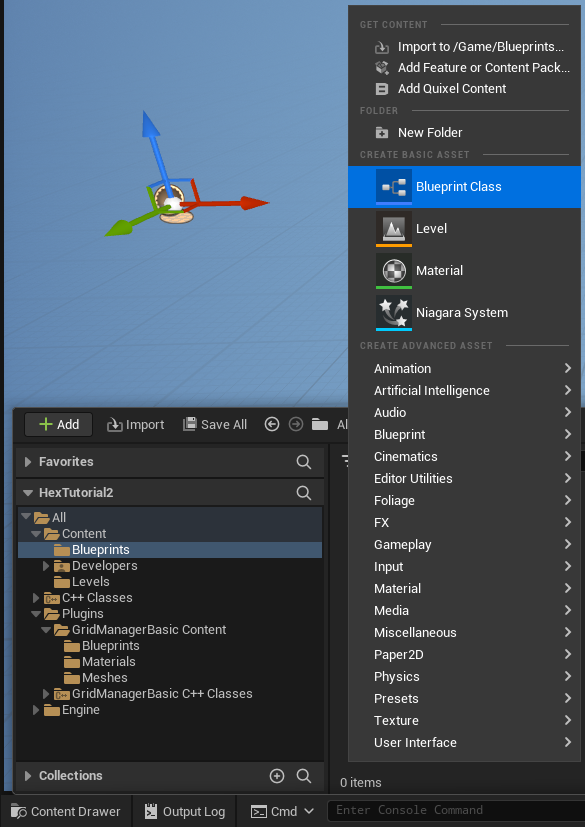
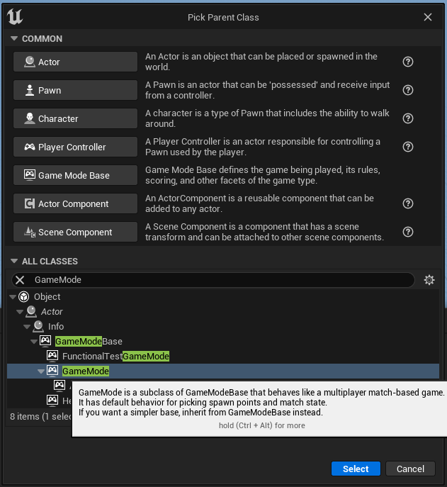
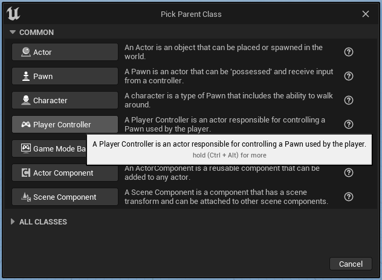
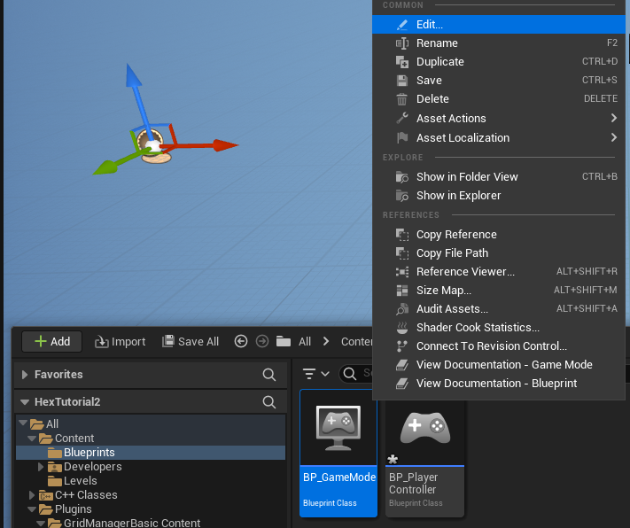
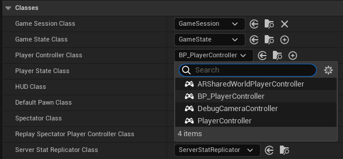
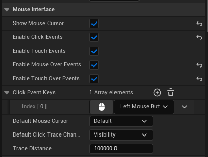
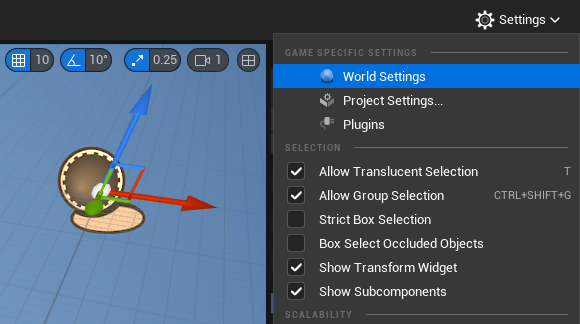
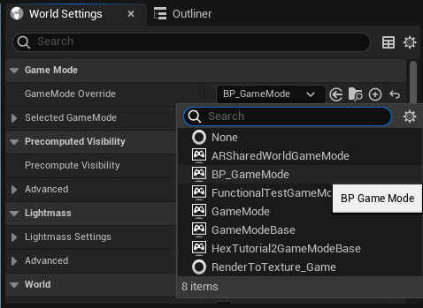

# Enable Mouse/Touch Events #

To work with mouse and touch events, your project must be configured to enable mouse and touch support by first creating a new GameMode and PlayerController, and then configuring them.

If you have already created a custom GameMode and/or PlayerController, skip those creation steps and apply the remaining steps to your existing PlayerController.

## Create GameMode ##

From the *Content Drawer*, create folder "All > Content > Blueprints" folder and create new a new Blueprint by clicking on the "Add" button or by right-clicking on the folder content area, and selecting "*(CREATE BASIC ASSET) Blueprint Class*":

&nbsp;

On the "Pick Parent Class" selector modal, under "All Classes", search for and select, "*Game Mode*", click the "Select" button, and name the new class, "*BP_GameMode*".

&nbsp;

## Create PlayerController ##

Follow the same steps for creating the PlayerController as you did for creating the GameMode, but instead select the *PlayerController* Parent Class:\

&nbsp;

## Configure GameMode and PlayerController ##

Right-click BP_GameMode and select "Edit" from the context-menu:\

&nbsp;

In the "classes" section, find "Player Controller Class" and set it to "*BP_PlayerController*" (remember to compile & save):\

&nbsp;

Now edit *BP_PlayerController*, and enable mouse & touch settings in the "Mouse Interface" section.:\

You can also add additional "Click Event Keys" here, if you want to differentiate between a left and right click.

&nbsp;

## Set Project Settings ##

Now, we just need to set the project to use the new GameMode.

From the level editor, click the Settings drop-down menu, and select "World Settings":\

&nbsp;

In World Settings, under the "Game Mode" section, set the "GameMode Override" to "*BP_GameMode*":\

You're done. The new GameMode/PlayerController settings are now your defaults.
