# Hex>Grid Manager Tutorial #

This tutorial will guide you through creating a simple demonstration of Hex>Grid Manager's features. By the end of this tutorial, you should have an understanding of how to utilize this plugin in your own projects.

\* Some of the screenshots will show the "BP_HexGrid" actor with the name "BP_HexGridManager". These are the same reference. \*

## Table of Contents ##

[Hex>Grid Manager Tutorial](#hexgrid-manager-tutorial)

* [New Project](#new-project)
* [Basic Setup](#basic-setup)
* [Mouse/Touch Events](#use-mousetouch-events)
* [Overlap Events](#use-overlap-events)
* [Other Examples](#other-examples)
* [Help](#help)

&nbsp;

## New Project ##

Create a new, **blank project**:\

&nbsp;

### Import Plugin ###

Import the Hex>Grid Manager into the new project.

&nbsp;

## Basic Setup ##

Create a new, **basic level** (File > New Level):\
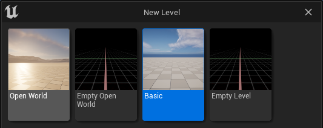

&nbsp;

### Place HexGrid in Level ###

From the **Content Drawer**, navigate to "*All > Plugins > GridManagerBasic Content > Blueprints*", then drag **BP_HexGrid**:\

&nbsp;

drop it into the new level, and configure the HexGrid instance by selecting it in the editor then **setting the following values and details** inside of *Details > Hex Grid* options:\
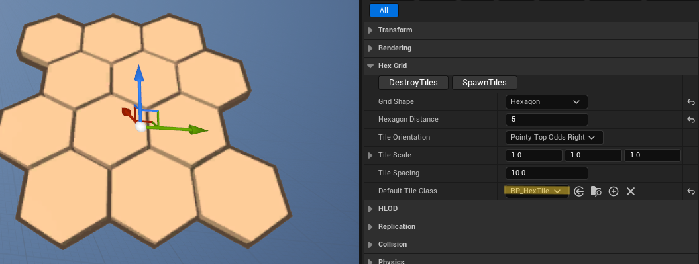
Be sure that inside of details > Hex Grid you have set Default Tile Class to **BP_HexTile** as failure to do so will result in a crash.

Set **Hexagon Distance** value to **5** (For tutorial purposes you are advised against setting a high value)

&nbsp;

(**Optionally**, click the **Spawn Tiles** button to spawn editor-only tiles in the editor.)\

&nbsp;

### Spawn Tiles ###

To spawn the tiles in-game, we need to call the [Spawn Tiles](../../documentation/documentation.md#spawntiles) Blueprint function. **Open the Level Blueprint** by opening the world blueprints drop-down menu, and selecting '*Open Level Blueprint*' (from the Level editor):\

&nbsp;

Right-click on the *Event Graph*, and select, "*Call Function on BP Hex Grid > Hex Grid > Spawn Tiles*":\

&nbsp;

Then drag the execute pin from the *Event BeginPlay* node to the [Spawn Tiles](../../documentation/documentation.md#spawntiles) node.\

&nbsp;

Now, when you compile and play this level, a tile grid will spawn. Save the level:\

(**Optional:** Play the level to see results)

**How majestic!**

&nbsp;

## Use Mouse/Touch Events ##

**NOTICE: MOUSE EVENTS WILL NOT FUNCTION IF YOU SKIP THIS SECTION**

**It is necessary to follow these steps provided by this link [Enable Mouse/Touch Events](../enable_mousetouch_events/enable_mousetouch_events.md) before any related Events will fire.**

There are four, independently-firing Mouse events, and the same is true for Touch events. With a little logic, events from both can be grouped into a common event lifecycle:

| Begin | Enter | Leave | End |
|---|---|---|---|
|Clicked|BeginCursorOver|EndCursorOver|Released|
|TouchBegin|TouchEnter|TouchLeave|TouchEnd|

&nbsp;

Let's build a demo that uses all of these events.

### Mouse Events ###

From the *Level Blueprint Event Graph*, with the **BP_HexGrid** selected on the Level editor, create the *OnTileClicked* Event node by right-clicking the Event Graph and selecting "*Add Event for BP Hex Grid > Hex Grid > Add On Tile Clicked*":\

Drag the "Touched Tile" pin out to create a new node, search for "set material", and select "Set Material":\

Drag the execute pin from the "*On Tile Clicked*" Event node to the "*Set Material*" node, and set Material to *M_ColorClick*:\
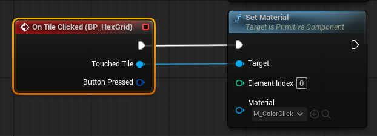

Repeat the same steps with *On Tile Begin Cursor Over*, (use *M_ColorBegin*):\
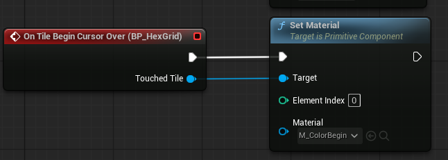

And with *On Tile End Cursor Over* (use M_ColorEnd):\
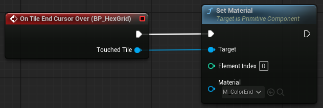

And *On Tile Released* (use M_ColorRelease):\

If you Compile & Run the Level now, you would be able to see the events in action, **however** if using the deafult camera controls you will find them to be unhelpful for this testing. You can [set up a static camera](../static_camera/static_camera.md) to deal with this. More complicated examples are available in the Level Blueprint for the example Level included with this plugin. The specifics of when these events fire is explained in the [documentation](../../documentation/documentation.md#events).

&nbsp;

### Touch Events ###

To group mouse and touch events, it is necessary to convert our event responses into Macros. Select our response to *On Tile Clicked*, right-click one of the nodes, and select "*Collapse to Macro*":\
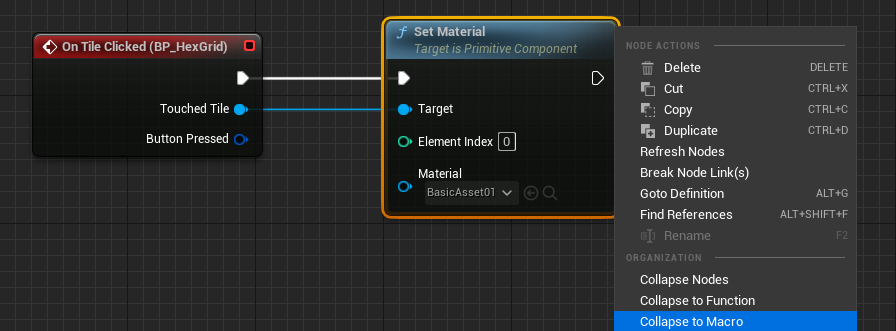

Name this Macro, "Begin":\

Set up the other three Macros:\

Now, Add all four **BP_HexGrid** touch events to the Level Blueprint, and connect them to the macros you just created. Additional macro nodes can be placed on the Event Graph by dragging them from the Macros section of the *My Blueprint* side-bar.\

&nbsp;

#### Use Mouse To Simulate Touch ####

To test this on you PC, you can set the Project to [use the mouse for touch](../use_mouse_for_touch/use_mouse_for_touch.md).

&nbsp;

## Use Overlap Events ##

There are two overlap events available for use; Begin Overlap & End Overlap. In order for them to function, overlap events must be enabled for the Actors (Actors you already have in your own project) in scene that you want to generate overlap events for. 

### Add Collision Box ###

Adding a collision box to an existing actor in a project is simple. Edit the actor blueprint (Content Drawer, double-click, or right-click, edit) and open the "*Viewport*". On the *Components* tool-bar, select the RootComponent and then click the "Add" button. Type "Box" and then select, "*Box Collision*":\
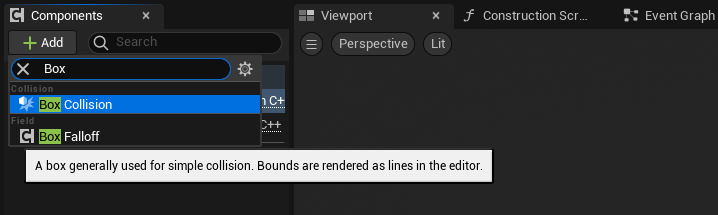

Use the *Viewport* to adjust the *Box Collision* appropriately for the expected use. You may want to set 'Visible' to false on the Box Collision if you are spawning the actor in the level editor. Be sure to compile & save.

### Add Tutorial Sphere Actor ###

To test overlap events, lets add another actor to the level. From the Content Drawer, in *All > Content > Blueprints*, create a new Blueprint (BP_Sphere) with Actor as the Parent Class, and then edit the new Blueprint. From the *Viewport*, add a *Sphere* and a *Box Collision* (be sure to compile & save):\

We're going to implement a very simple mouse-move mechanic in order to test overlap events. On **BP_Sphere**'s Event Graph, add a new **Boolean** variable named *IsBeingMovedByMouse*, and then add the following function:\
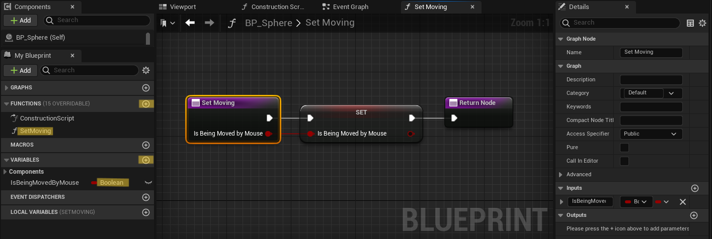

Subscribe to relevant mouse and touch events to keep the *IsBeingMovedByMouse* variable updated:\

Add the following nodes to the Event Graph, and then you should be able to drag the sphere around:\

There's an improved version of the mouse-drag blueprint on the BP_Sphere Actor in the Example level.

### Overlap Events ###

Let's subscribe to the overlap events and add some reactions:\

Disable the Mouse/Touch event responses and play the level. When you drag the Sphere Actor through any tile, it should produce a reaction. You may need to adjust the static distance Float to produce an overlap with a tile. If the events aren't firing, check that "*Generate Overlap Events*" is set to true under *Details > Collision* for the Mesh and Box Collision of the Tile and Actor.

## Other Examples ##

The following Blueprints demonstrate features of the Hex>Grid Manager plugin. All Events and Functions are [documented here](../../documentation/documentation.md).

&nbsp;

Function: Set Material for (an Array of) Tiles.\
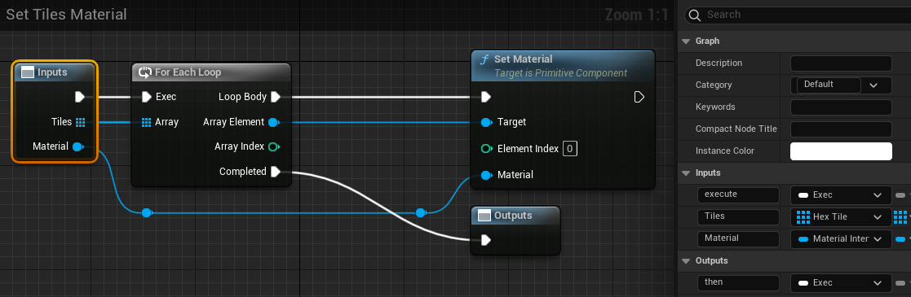

Set Material for Neighbor Tiles.\
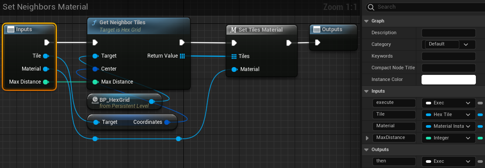

Set Material for Tile at a specific distance.\
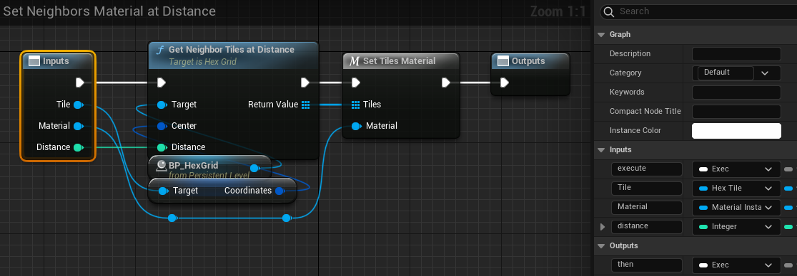

Move Actor to Tile.\

On the Level Blueprint Event Graph, combine all of the functions into a response to Tile Clicked.
\

&nbsp;

## Help ##

* **Documentation:** Available [here](../../documentation/documentation.md).
* **Tutorials:** Learn the basics with these [tutorials](./documents/tutorials/README.md).
* **Videos:** Coming soon on [YouTube](https://www.youtube.com/@Mj12Studio).
* **Discord:** Join our community on [Discord](https://discord.gg/2SsKNeHY3u).
