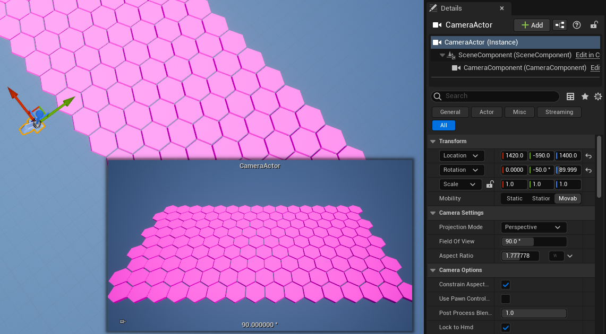

# Set up static camera

It can be desirable to set up a static camera for many reasons. It can be helpful when testing mouse-related events, for example.\
Whatever the reason, it only takes a moment. Here's how:

From the level editor, open the "Quickly add to the project" dropdown and select "*CameraActor*", then\
position the camera according to your needs.\

Find the "*Details > Auto Player Activation*" and set **Auto Activate for Player** to "*Player 0*"\

This camera should now be the default view when you play the level
