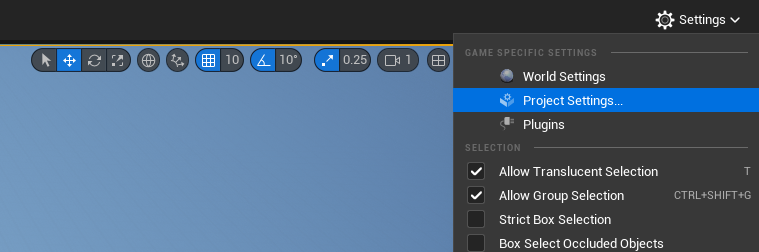
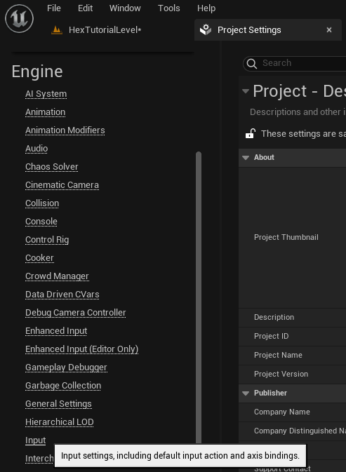
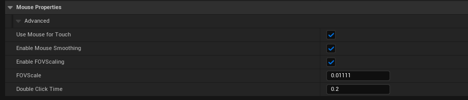

# Use Mouse To Simulate Touch #

To test this on you PC, you can set the Project to use the mouse for touch. Do this by opening the *Project Settings*:\

Inside *Project Settings*, open the "*Engine > Input*" area,\

find the "*Mouse Properties*" section, and set *Use Mouse for Touch* to true.

You'll find that the behavior differs from that of the Mouse events- some events will fire simultaneously. To bring the two behaviors into alignment, we'll need to add some variables to our Level Blueprint, and modify the Begin, Enter, Leave, & End Macros. An example of this can be found in the Level Blueprint for the example Level included with this plugin.

&nbsp;
